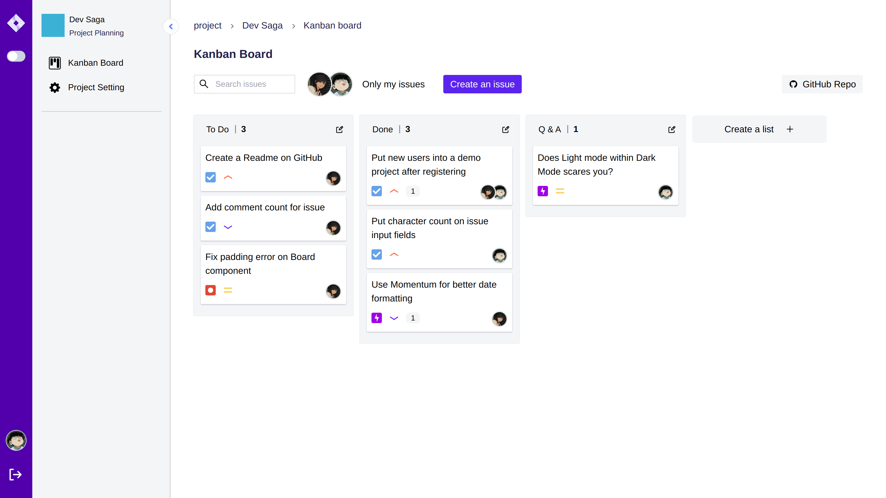

# jira-clone



<br/>

## What is this and why?
I am a web developer working on frontend projects with react, nextjs and UI libraries. I feel like I am not growing that much in this field and tried learning the server-side technologies. This project is to hone my react skill and get experience in developing a web server and a database.  
This is a minimalist replica of a issue-tracking software called [Jira](https://www.atlassian.com/software/jira). Although I said it is a replica, the design is inspired from an another repository. According to [Datlype](https://github.com/Datlyfe/jira_clone), his project is a clone of a clone which makes mine as **a clone of a clone of clone**. 🗿🗿

<br/>

## Technologies
**Typescript, React, RTK Query, Tailwindcss, Express, MySQL, Prisma**

<br/>

## Project Structure

```
.
├── express-backend
│   ├── controllers
│   ├── prisma
│   ├── routes
│   └── utils
├── react-frontend
│   ├── public
│   ├── src
│   │   ├── components
│   │   │   ├── auth
│   │   │   ├── dnd
│   │   │   ├── home
│   │   │   ├── issue
│   │   │   ├── list
│   │   │   ├── project
│   │   │   └── util
│   │   ├── api (RTK Query)
│   │   └── store (Redux Toolkit)
└── README.md

```

## Contribution
Raising issues, fixing bugs and creating pull requests. Any kind of contributions are welcome!
